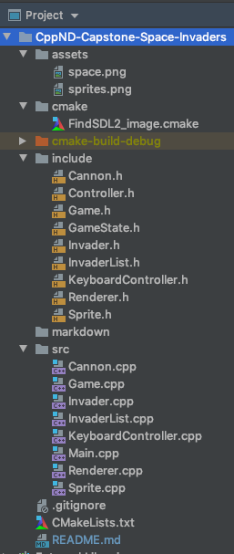

# CPPND: Space Invaders

## Description
Space Invaders is a classical 2D game which was introduced in the late 70's.  The game consists of an array of invaders
who are trying to make their way to the bottom of the screen.  The player, controls a cannon which moves left or right
and can shoot one projectile at a time at the invaders to destroy them.  The invaders can also collectively drop one 
bomb at a time trying to destroy the player's cannon.  The game ends when either the player's cannon is destroyed by 
a bomb, the invaders have made it to the bottom of the screen, or the player has successfully destroyed all invaders.

## Implementation

The game works using the SDL2 game engine to render a bunch of different sprites to the screen at a particular framerate.

---
## Dependencies for Running Locally
* cmake >= 3.7
  * All OSes: [click here for installation instructions](https://cmake.org/install/)
* make >= 4.1 (Linux, Mac), 3.81 (Windows)
  * Linux: make is installed by default on most Linux distros
  * Mac: [install Xcode command line tools to get make](https://developer.apple.com/xcode/features/)
  * Windows: [Click here for installation instructions](http://gnuwin32.sourceforge.net/packages/make.htm)
* SDL2 >= 2.0
  * All installation instructions can be found [here](https://wiki.libsdl.org/Installation)
  * Note that for Linux, an `apt` or `apt-get` installation is preferred to building from source.
* SDL2 Image >= 2.0
  * All installation instructions can be found [here](https://www.libsdl.org/projects/SDL_image/)
  * Note that for Linux, an `apt` or `apt-get` installation is preferred to building from source.
* gcc/g++ >= 5.4
  * Linux: gcc / g++ is installed by default on most Linux distros
  * Mac: same deal as make - [install Xcode command line tools](https://developer.apple.com/xcode/features/)
  * Windows: recommend using [MinGW](http://www.mingw.org/)

## Basic Build Instructions

1. Clone this repo.
2. Make a build directory in the top level directory: `mkdir build && cd build`
3. Compile: `cmake .. && make`
4. Run it: `./SpaceInvaders`.
